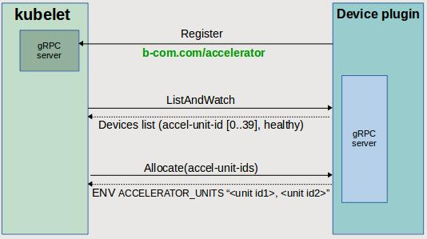

# k8s-accelerator-devplugin

## Presentation

`k8s-accelerator-devplugin` is a [device plugin](https://github.com/kubernetes/community/blob/master/contributors/design-proposals/resource-management/device-plugin.md) for kubernetes to manage AWS/Intel FPGA accelerator.

The plugin should be deployed as a k8s daemonset so that one pod instance runs on each k8s worker node.

This device plugin is required when the pod needs to know the identifiers of the resources on which it has gained access. Because the default k8s [Extended Resources for a Node](https://kubernetes.io/docs/tasks/administer-cluster/extended-resource-node/) manage only generic resources, keeping count of allocated and available resources but without identifying these resources.

Whenever k8s allocates an accelerator resource to a pod, the device plugin passes the resource identifier to the pod container through an environment variable.

An Intel accelerator is called an AFU (Accelerator Functional Unit) and is accessible through a device node `intel-fpga-port.<instance id>`.
For Intel, the plugin parses the `/sys/class/fpga/` directory tree to find the list of available accelerators on the current node. Each accelerator is identified by its PCI bus, device and function identifiers. The BDF ids are preferred over instance ids because they are required by the accelerator application to filter the device during enumeration.

Note: unlike the AWS k8s plugin which exposes the same number of accelerator units on all nodes of the k8s cluster., the Intel plugin exposes to kubernetes a list of the accelerators really present on the node.

## k8s device plugin design

The figure below shows how the k8s device plugin should be implemented. The source code has been adapted from the [NVIDIA k8s-device-plugin](https://github.com/NVIDIA/k8s-device-plugin).



On startup the plugin instantiates its own gRPC server to serve kubelet requests. Then it registers near the Kubelet gRPC server with its gRPC socket and the resource `b-com.com/accelerator` to be exposed.

Then the kubelet asks to the plugin the list of available resource accelerators by calling the `ListAndWatch` method. The plugin replies with the available devices list, each containing a device or bus:device.function pci identifier and its state (healthy or unhealthy). The number of resources is by default 40 but it may be modified with a plugin argument. The plugin could update the devices list on change (new device, device removed, device state change) but for now it is not implemented.

Once the plugin has sent the list of devices it manages, the kubelet advertises those resources to the API server so the node status is updated to advertise the accelerator resources.

Then, users can request accelerator devices in a Container specification as they request other types of resources. When the pod is created on a node, this node kubelet notifies the plugin of the accelerator resource(s) allocated to the pod by calling the `Allocate` method. Note that Kubernetes chooses alone which resource identifier(s) it gives to the pod and these identifiers may not be consecutive.

On `Allocate`, the plugin returns an AllocateResponse with a container environment variable `ACCELERATOR_UNITS` to be passed by kubelet to the container runtime. This env variable contains a comma separated list of the accelerator unit or (bus:device.function) identifier(s) allocated to the pod. It can then be used by the container application to access the corresponding FPGA resources.

## Prerequisites

The plugin has been implemented with the `v1beta1` version of the kubelet device plugin API, which is supported by Kubernetes version 1.10.x.

As the device plugin feature is still an experimental feature of Kubernetes, its activation has to be configured at kubelet startup. If the Kubernetes cluster is deployed using kubeadm and the nodes are running systemd, modify the kubeadm systemd unit file `/etc/systemd/system/kubelet.service.d/10-kubeadm.conf` by adding the following environment argument:

* For AWS
```shell
Environment="KUBELET_EXTRA_ARGS=--feature-gates=DevicePlugins=true"
```
* For Intel
```shell
Environment="KUBELET_EXTRA_ARGS=--feature-gates='DevicePlugins=true,HugePages=true'"
```

Reload and restart the kubelet to pick up the config change:

```shell
$ sudo systemctl daemon-reload
$ sudo systemctl restart kubelet
```


## Build and installation

### local build

The Go sources dependencies are managed with the experimental [dep](https://golang.github.io/dep/docs/introduction.html) tool.

`dep init` was used to create the files `Gopkg.toml` and `Gopkg.lock` which list the required packages along with their versions.

Just after the `kubernetes` project git clone, `dep ensure` should be run from the `k8s-aws-accelerator-devplugin` or `k8s-intel-accelerator-devplugin` directory to populate the `vendor/` directory with the dependent packages sources.

Build : `go install b-com.com/k8s-aws-accelerator-devplugin`
Build : `go install b-com.com/k8s-intel-accelerator-devplugin`

### build on the kubernetes host

To build directly the plugin executable and generate the Docker container image on the kubernetes host, first transfer files to this host

`scp *.go Gopkg.* *.yml Dockerfile* *.sh <user>@<ipaddr>:<plugin directory path>`

The build contains two stages:

* compile the go sources into a first container where the Go language is installed,
* build a second container image with the generated plugin executable.

With docker-ce 17.05 or higher, the build is generated in one step with the multi stage dockerfile:

```shell
   docker build -f Dockerfile.multistage --rm -t accelerator-device-plugin .
```

With docker-ce lower than 17.05, use the script `build.sh` which first generates the plugin based on the file `Dockerfile.build` and then generates the plugin container image based on the file `Dockerfile`.

### install the k8s device plugin

For test purpose, the plugin could be launched manually:

```shell
docker run --rm -it -v /var/lib/kubelet/device-plugins:/var/lib/kubelet/device-plugins accelerator-device-plugin:latest
```

And the plugin logs can be accessed with:

```shell
docker exec -it <container id> cat /var/log/k8s-accelerator-devplugin.log
```

To instantiate the device plugin on each k8s cluster node, deploy it as a daemonset. The number of available accelerator resources is modifiable in the yaml file with the "-accel-nbunits" argument.

```shell
kubectl create -f accelerator-device-plugin.yml
```

## Using accelerator resources into PODs

The file `pod-example.yml` specifies a pod requesting one instance of the `b-com.com/accelerator` resource.

The command `kubectl describe node <nodename>` displays the number of available `b-com.com/accelerator` resources, ex

```
Capacity:
 b-com.com/accelerator:  9
 cpu:                    2
...
Allocatable:
 b-com.com/accelerator:  9
 cpu:                    2
```

## About

This plugin has been developed in the NGPaaS project. This project has received funding from the European Union’s H2020-ICT-2016-2017 Programme under grant agreement n° 761557

